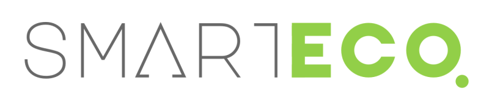

# What is it?
Smart Eco is a package that allows you to connect your application to the NEO blockchain without any knowledge about lower level blockchain principles. Your application will no longer need to build its own wallet in order to access all of the power of the NEO blockchain.

## Concepts

### What is a Provider?

For the user a provider, often times known as a wallet, is a software application responsible for managing private keys on their behalf. A user trusts this application to responsibly sign transactions and submit them to the chain.

For a decentralized application developer, a provider abstracts a connection with NEO blockchain network, and takes care of lower level operations like private key management, transaction signatures, and RPC node management.

A developer can connect easily to a user via a provider. The provider can handle authentication so that the user can always feel secure using their preferred wallet.

### NEO DAPI
The NEO DAPI is a shared interface for providers to adhere to. Any provider in this package will conform to a shared interface as described [in the NEO core project.](https://github.com/neo-project/proposals/pull/69)

This shared interface is what allows you as a Dapp Developer to reach a user, whether he is using the O3 Wallet on Desktop, the NEL Chrome Extension on Chrome, or some other provider.

### What is the advantage of using Provider?
If you are just getting started with blockchain development, it is unlikely that you want to build your own wallet. There are numerous security risks, and the wallet itself will likely be signficantly more complicated than the actual application you want to build.

Offloading this work to a trusted wallet provider will greatly speed up development time, reduce security for both the user, and developer, and prevent ecosystem fragmentation where each application needs its own wallet. 

## Installation and Usage

smartEco will be available through npm in the future, for now please clone this respository to install.

The Test Directory contains a simple example web page that show cases the uses of the NEO DAPI. 

## Usage

```javascript
engine = new smartEco.NEOProviderEngine()
engine.start()

//Add Event Listeners
engine.addEventListener(smartEco.EventName.READY, onReady);
engine.addEventListener(smartEco.EventName.CONNECTED, data => {});
engine.addEventListener(smartEco.EventName.ACCOUNT_CHANGED, data => {});
engine.addEventListener(smartEco.EventName.DISCONNECTED, data => {});

//Calling DAPI Method
function getAccount() {
  engine.sendAsync("getNetworks", undefined)
  .then(handleSuccess)
  .catch(handleError);
}
```

## Currently Supported Providers
 

**Documentation:** https://docs.o3.network/neoDapi/

**Github:** https://github.com/O3Labs/o3-dapi/tree/master/packages/neo

## Maintenance and Contribution
This package is currently maintained as a collaboration between O3 Labs and NEL. If you wish to register as a provider with in this package, please leave an issue in github.

## License

MIT