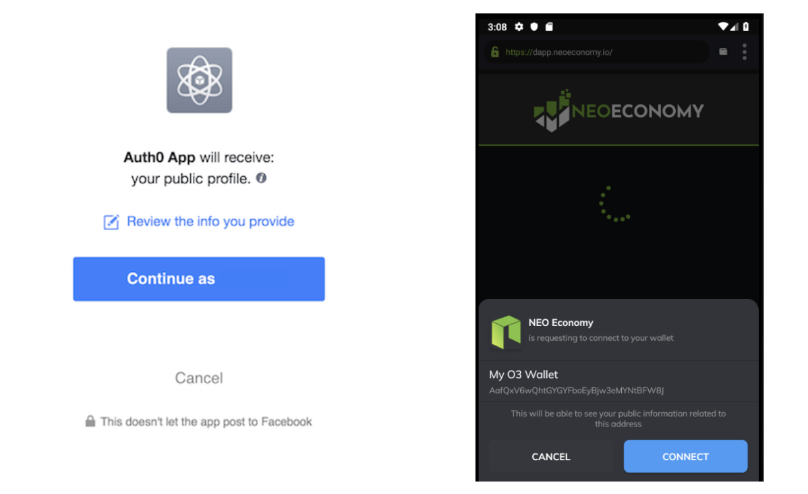
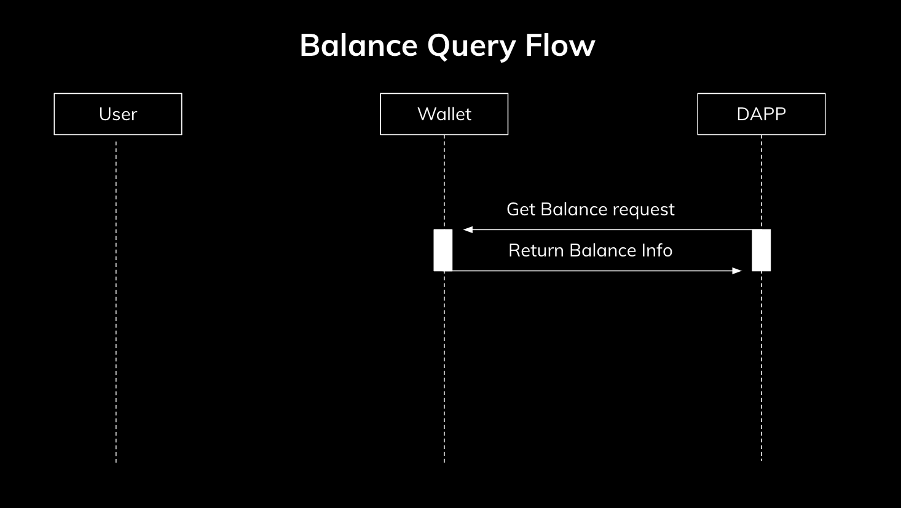

# A Comprehensive Guide to SmartEco
- [Setting Up Your Developer Environment](#Setting%20Up%20Your%20Developer%20Environment)
- [SmartEco Environment Architecture](#SmartEco%20Environment%20Architecture)
  * [Examples of HAPPS](#Examples%20of%20Happs)
  * [SmartEco Advantages](#SmartEco%20Advantages)
- [Connect To a Wallet](#Connect%20to%20a%20Wallet)
  * [Get Provider Details](#Get%20Provider%20Details)
  * [Get Available Networks](#Get%20Available%20Networks)
  * [Get User Account Information](#Get%20User%20Account%20Information)
- [Using the Read Methods](#Using%20the%20Read%20Methods)
  * [Querying Account Balances](#Querying%20Account%20Balances)
  * [Querying Smart Contract Storage](#Querying%20Smart%20Contract%20Storage)
- [Using the Write Methods](#Using%20the%20Write%20Methods)
  * [Requesting a User Transaction](#Requesting%20a%20User%20Transaction)
  * [Invoking a Smart Contract](#Invoking%20a%20Smart%20Contract)
- [Listening for Events](#Listening%20For%20Events)
- [Conclusion](#Conclusion)

## Setting Up Your Developer Environment
For your developer environment you will need to download a SmartEco compatible client. A complete list of SmartEco compatible clients [can be found here.](https://github.com/O3Labs/SmartEco#currently-supported-providers)

In this tutorial we will be using the O3 desktop client which was the first SmartEco compatible client. You can find your the installation link for your operating system at https://o3.network/

Once you have installed the softwar and created a new wallet, you can test out to make sure everything is functioning properly by heading to your preferred browser (Chrome, Safari, Brave, etc.) and opening up the [SmartEco testbed.](https://s3-ap-northeast-1.amazonaws.com/network.o3.apps/dapi/neo/testDapp.html)

The testbed is a simple interface that lets you test out all available SmartEco API's, feel free to return to it at any time if you want to test various providers, functions, etc.

Let's try our first function. If you click on the Get Provider button you will receive some basic info about the O3 Wallet, including its name, website, and version. If you see this out then you can successfully confirm that you are in a SmartEco environment.

 

If you want do do a follow up test you can click on getAccount, this should prompt you for your account credentials in O3.


This should give you a basic understanding of how apps can function in a SmartEco  environment. 

Congratulations! You've just taken your first step to connect yourself and your application to the Smart Economy.

Before diving into all of the implementation details let's take a closer look at the Architecture of SmartEco. 

## SmartEco Environment Architecture
The architecture of SmartEco is meant to be a horizontally scaleable middleware solution that connects any application to the NEO blockchain through a provider layer. A **provider** can be a wallet, dedicated dapp browser/explorer, chrome extension or other application.

A **provider** must implement a shared interface as described in the [NEO enhancement proposal](https://github.com/neo-project/proposals/pull/69). Implementing this interface makes the provider **SmartEco Compatible.**

So if a user is operating in an environment, where a SmartEco Compatible provider is present, they are said to be in a **SmartEco Environment**.

All SmartEco compatible providers will be included in the list of providers in the [SmartEco package.](https://github.com/O3Labs/SmartEco#currently-supported-providers)

Below is a full stack diagram describing the acrchitecture of a SmartEco Environment. 


At the base layer we have the NEO blockchain. [A turing complete blockchain platform](https://github.com/neo-project) which utilizes the native currencies NEO and GAS for its economic system. 

In the second layer, the NEO project describes a dAPI (decentralized API) interface which clients of the NEO blockchain should implement, if they want to serve as a provider for **hybrid applications or HAPPS**. We will more clearly define HAPPS shortly, for now it is sufficient to know that they exist at the top level of a SmartEco Environment. 

The provider layer which comes next implements and potentially extend the interface described in the dAPI. The providers will generate and broadcast transactions, and is in general responsible for privaate key management. So for a simple example, in the provider layer is actually where the "Send" operation occurs.

On top of the provider layer is SmartEco, which acts as a routing system for HAPPS between providers. All HAPP requests will be routed to various providers for execution. It exposes the same general methods as those described in the dAPI. Having this routing layer prevents ecosystem fragmentation as a HAPP can easily support multiple providers with just one package.

Finally ay the top level we have the HAPPS.

We define **HAPPS** as applications that use a mixture of decentralized architecture, for user safety, security, and progrommatic trust, and more traditional server client architecture for speed, user convenience, and efficiency.

### Examples of HAPPS
1. A website which processes cryptocurrency payments as method of receiving payment for services. 

2. A website which uses blockchain ID's (addresses) as user credentials, and authenticates via blockchain based signatures.

3. A website with deployed smart contracts that allows for trustless user trade, but also allows for a trusted escrow service for exchange.

HAPPS fundamentally differ from DAPPS in that there is no expectation or need for all or even the majority of infrastructure to run in a completely decentralized manner. Rather they should use it where it clearly improves user security, experience, privacy or can rely on shared resources to reduce development time or costs.


### SmartEco Advantages

With this architecture, an application which wishes to connect to the blockchain no longer needs to build out its own dedicated wallet infrastructure. Wallet infrastructure can be costly to build out, and requires a large amount of trust from the user if they are to be trusted with the private key. The SmartEco architecture allows for a clear seperation of concerns between HAPPS and providers.


With this seperation of concerns a user can choose which wallet to trust with their private key. They no longer have to trust the private key with each individual decentralized application. It also greatly lowers the development time for the application developer. Instead of building up their own raw transactions, a developer can specify contract invocations via simple json formats. Now with a basic understanding of SmartEco Architecture, you are ready to get started and connect your HAPP to a wallet.

## Connect to a Wallet
As a decentralized application the first things that you might like to do is connect to a user wallet. By connecting to a user wallet you would be able to access a users publicly identifiable information using their address. You can think of this wallet connection as a decentralized version of OAuth connection. You will access authenticate a user using their credentials on the publicly available blockchain as opposed to a closed source provider like Facebook.



Lets now look at how connect to the wallet using the decentralized API. First lets look at the general flow map.


As you can see when the user first opens your DAPP via the browser you must check to see if the user is in a SmartEco Evnironment. If the user's environment is not SmartEco compatible, then it will be impossible for you to access features like the user account info. 

After you have installed the SmartEco Package via npm and included it in your project you will need to declare an instance of the SmartEcoRouter.

``` javascript
smartEcoRouter = new smartEco.SmartEcoRouter()
smartEcoRouter.start()
```

This object will handle all of your requests and guide them to the appropriate provider. If the user is in a SmartEco Environment then you can call the method as follows.

### Get Provider Details


``` typescript
smartEcoRouter.getProvider()
.then((provider: Provider) => {
  const {
    name,
    website,
    version,
    compatibility,
    extra,
  } = provider;

  const {
    theme,
  } = extra;

  console.log('Provider name: ' + name);
  console.log('Provider website: ' + website);
  console.log('Provider dAPI version: ' + version);
  console.log('Provider dAPI compatibility: ' + JSON.stringify(compatibility));
  console.log('Provider UI theme: ' + theme);
})
.catch(({type: string, description: string, data: any}) => {
  switch(type) {
    case NO_PROVIDER:
      console.log('No provider available.');
      break;
    case CONNECTION_DENIED:
      console.log('The user rejected the request to connect with your dApp.');
      break;
  }
});

```
If the user is in a SmartEco compatible environment, then it is expected that you will be returned a structured JSON format something like this.

```json 
{
  "name": "Awesome Wallet",
  "website": "https://www.awesome.com",
  "version": "v0.0.1",
  "compatibility": [
    "NEP-5",
    "NEP-XX",
    "NEP-YY"
  ],
  "extra": {
    "theme": "Dark Mode"
  }
}
```
This will give you basic info about the provider environment that you are operating in. 

<aside class="notice">
It's important that each provider is responsible for their own implementation of the NEO dAPI. This means that there they may be discrepancies between behaviors in different provider environments. Because of this, please reference the provider documentation when working with a particular provider. For instance if O3 was the provider environment, then you could reference https://docs.o3.network/neoDapi/ for complete implementation detail.
</aside>

### Get Available Networks
After you have confirmed that you are in a SmartEco environment, its is highly reccommended that you check which networks are available for you to use. The main NEO network is typically known as the  ```MainNet```, but there is also a publicly available ```TestNet``` which allows you test various operations without risking real funds on the main network. Additionally, you may have the ability to connect to a ```PrivateNet```. This network is generally not publicly available and may be only running locally on your machine. This could be useful if you are exploring core changes to the NEO Protocol.

The client is responsible for providing info on which networks are available for you to connect to. This is done for security purposes, since a user may only want a DAPP to interact with the Testnet, and prevent malicious actors from sending transactions on the MainNet without user consent.

Use the following code to query which networks are available for you to interact with in the SmartEco Environment.

``` typescript
smartEcoRouter.getNetworks()
.then(response => {
  const {
    networks,
    defaultNetwork,
  } = response.networks;

  console.log('Networks: ' + networks);
  // eg. ["MainNet", "TestNet", "PrivateNet"]

  console.log('Default network: ' + defaultNetwork);
  // eg. "MainNet"
})
.catch(({type: string, description: string, data: any}) => {
  switch(type) {
    case NO_PROVIDER:
      console.log('No provider available.');
      break;
    case CONNECTION_DENIED:
      console.log('The user rejected the request to connect with your dApp');
      break;
  }
});
```

### Get User Account Information

Now that you have confirmed the details about the SmartEco Environment that you are operating you can request account details about the user accessing your decentralized application. This will provide you with some basic information about the **user identity**, namely, the user's address.

<aside class="warning">
It is highly reccomended for privacy and security reasons that all provider implementations require user consent before relaying this information back to the DAPP.
</aside>

Request the user credentials as follows.

``` typescript
smartEcoRouter.getAccount()
.then((account: Account) => {
  const {
    address,
    label,
  } = account;

  console.log('Account address: ' + address);
  console.log('Account label: ' + label);
})
.catch(({type: string, description: string, data: any}) => {
  switch(type) {
    case NO_PROVIDER:
      console.log('No provider available.');
      break;
    case CONNECTION_DENIED:
      console.log('The user rejected the request to connect with your dApp');
      break;
  }
});

```
If a user authenticated your decentralized application to know their account details you will receive a json object that looks like this

``` json
{
  "address": "AeysVbKWiLSuSDhg7DTzUdDyYYKfgjojru",
  "label": "My Spending Wallet"
}
```
At this point you are considered to be in a **connected** state with the provider. In the connected state you have a direct connection between the user, the NEO blockchain, and your application.

You can perform many functions in the connected state. First it will allow you to query all publicly available info associated with this address on the blockchain. For instance, you could check a users balances of NEO, GAS, or various NEP-5 tokens. You could also find all of their stored NNS (NEO Name Service) aliases. Thus we can have a glimpse at the power of blockchain connectivity and smart contracts. It moves data queries away from private data silos, and into a publicly accessible shared data space (the blockchain).

However this identity doesn't just have to be used to query already existing public info. If you're feeling more adventurous, then you could this address as the primary key in your database for users. Since each NEO Address is guaranteed to be unique, you could use this to replace the traditional email/password authentication on your website. Or you could even create your own smart contracts, and add data back into the shared data space.

So in summary, we've described how to a connect your application to SmartEco compatible provider, and examined a few use cases including using it as an authentication mechanism as well as a public id to query public blochchain info, as well as using it as the primary identifier in your own database. 

In the next section we will cover how to access the read methods provided by SmartEco, to get some of the publicly identifiable info that we described earler..

## Using the Read Methods
Read methods allow you to query blockchain info that is publicly available. You will first need to go through the connection process before invoking the read methods. In this example, we will focus on the specific example of querying balances.

However the complete list of available read methods is
* **getBalances** -> get balances for NEO/GAS and NEP5 tokens
* **getStorage** -> get value for key in smart contract storage
* **invokeRead** -> perform a contract invoke in read only mode, this will let you to see the results of an invocation without actually publishing those results on chain

### Querying Account Balances
One of the key features of NEO and other blockchains is digital assets. Digital assets are assets on chain that are represented via smart contract. They can be easily transferred amongst other within the blockchain. Thus if you want to get more information about a user's balances you can use SmartEco to query for that info like below.

 

 You'll note that the balance query flow in general is much simpler than the initial connection flow. Since the user has already granted for the dapp to view their public address, querying read only info does not require any authentication from the user. 

``` typescript
smartEcoRouter.getBalance({
  "params": {
    "address": "AeysVbKWiLSuSDhg7DTzUdDyYYKfgjojru",
    "assets": ["NKN"]
  },
  "network": "MainNet",
})
.then((results: BalanceResults) => {
  Object.keys(results).forEach(address => {
    const { balances } = results[address];
    Object.keys(balances).forEach(balance => {
      const { assetID, symbol, amount } = balance

      console.log('Address: ' + address);
      console.log('Asset ID: ' + assetID);
      console.log('Asset symbol: ' + symbol);
      console.log('Amount: ' + amount);
    });
  });
})
.catch(({type: string, description: string, data: any}) => {
  switch(type) {
    case NO_PROVIDER:
      console.log('No provider available.');
      break;
  }
});
```

 Here is an example of a typical json input from the application, and an output returned from the wallet.

``` json
 //input
{
  "params": {
    "address": "AeysVbKWiLSuSDhg7DTzUdDyYYKfgjojru",
    "assets": ["NKN"]
  },
  "network": "MainNet",
}

//output
{
  "AeysVbKWiLSuSDhg7DTzUdDyYYKfgjojru": [
    {
      "assetID": "c36aee199dbba6c3f439983657558cfb67629599",
      "symbol": "NKN",
      "amount": "0.00000233",
    }
  ],
}
```

Note that it is required to specify a network in order to access most read methods. The list of available networks can be found using the **getNetworks** command as described above. 

It's as simple as that, if the user has already authenticated your decentralized application, then read only methods can be called at will. It's important to note that if your application relies heavily on read only methods, then it might be a good idea to offload some of that infrastructure on your own application. 

This should generally improve latency, however if you're just getting started or only need to make use of a few read methods, then the provided SmartEco methods are a quick way to access the blockchain without building up your own infrastructure. 

In this next section we will be examining how to use write methods. Write methods will allow you to alter the state of the blockchain on behalf of the user.

## Using the Write Methods

Write methods are those that allow you to alter the state of the blockchain on behalf of the user, there are two types of write methods. Sending a transaction and invoking a smart contract. Let's first look at the flow diagram for sending

### Requesting a User Transaction


As you can see your decentralized application will first request to create a send on the users behalf to the wallet using a structured json format. An example of this json format would look like

``` json
{
  "fromAddress": "ATaWxfUAiBcQixNPq6TvKHEHPQum9bx79d",
  "toAddress": "ATaWxfUAiBcQixNPq6TvKHEHPQum9bx79d",
  "asset": "GAS",
  "amount": "0.0001",
  "remark": "Hash puppy clothing purchase. Invoice#abc123",
  "fee": "0.0001",
  "network": "MainNet"
}
```

The user should then be asked to authorize this transaction via a visual confirmation dialog from their wallet. If the user accepts this transaction, then the provider will be responsible for parsing the JSON and generating the raw hex code that represents the transaction. It will then relay this transaction to the NEO network via an RPC node. If the transction is successful, then the a transaction id will be returned to your application as a receipt.

<aside class="notice">
After receiving the transaction ID from the wallet, it can handle this in many ways, to verify that the transaction was indeed successfully submitted.
</aside>

1. **Trust the provider implementation** -> If you trust the wallet provider to relay the transaction then you can simply confirm that the transaction has indeed been included in the mempool, and allow for a zero confirmation transaction
2. **Compare transaction ID's** -> If you do not trust the provider implementation, then you can generate the transaction ID from your end, and then confirm the end result with the wallets implementation. This will guarantee that transaction that ended up in the mempool is what you expect to be
3. **Wait for one block confirmation** -> Since NEO has one block finality, you can wait for the transaction to be processed from the mempool, and actually put into the block. From there you can detect if the expected result is correct
</aside>

A code example of the input described above can be found below
``` typescript
smartEcoRouter.send({
  "fromAddress": 'ATaWxfUAiBcQixNPq6TvKHEHPQum9bx79d',
  "toAddress": 'ATaWxfUAiBcQixNPq6TvKHEHPQum9bx79d',
  "asset": 'GAS',
  "amount": '0.0001',
  "remark": 'Hash puppy clothing purchase. Invoice#abc123',
  "fee": '0.0001',
  "network": 'MainNet'
})
.then(({txid, nodeUrl}: SendOutput) => {
  console.log('Send transaction success!');
  console.log('Transaction ID: ' + txid);
  console.log('RPC node URL: ' + nodeUrl);
})
.catch(({type: string, description: string, data: any}) => {
  switch(type) {
    case NO_PROVIDER:
      console.log('No provider available.');
      break;
    case SEND_ERROR:
      console.log('There was an error when broadcasting this transaction to the network.');
      break;
    case MALFORMED_INPUT:
      console.log('The receiver address provided is not valid.');
      break;
    case CANCELED:
      console.log('The user has canceled this transaction.');
      break;
    case INSUFFICIENT_FUNDS:
      console.log('The user has insufficient funds to execute this transaction.');
      break;
  }
});
```

This would return data as follows
``` json
{
  "txid": "ed54fb38dff371be6e3f96e4880405758c07fe6dd1295eb136fe15f311e9ff77",
  "nodeUrl": "http://seed7.ngd.network:10332"
}
```

<aside class="notice">
Notice that you also receive the nodeURL of where this transaction was submitted to. Since the transaction should be propogated to the network almost instantaneously, you can verify that the node is not holding onto the transaction by checking the mempool of another node.
</aside>

In summary we have now described the basic process for requesting transaction sends on behalf of the user we are ready, we can see the formation of a decentralized architecture take place. Sending assets is the most basic way to the alter the state of the blockchain. However we will now expand it into generic contract invokes. This will allow you to call any method, on any public smart contract on behalf of the user in a secure way. 


### Invoking a Smart Contract
We'll now go over the final write method which is the most flexible and powerful write methods This will allow for general smart contract invocations. The overall flow of invoking a smart contract follows the same process as the send flow. 


As an example, let's consider a simple contract that stores key value pairs. Here is an example of a code snippet to invoke the contract.

```typescript
smartEcoRouter.invoke({
  scriptHash: '505663a29d83663a838eee091249abd167e928f5',
  operation: 'storeData',
  arguments: [
    {
      type: 'string',
      value: 'hello'
    }
  ],
  fee: '0.001',
  network: 'TestNet',
})
.then(({txid, nodeUrl}: InvokeOutput) => {
  console.log('Invoke transaction success!');
  console.log('Transaction ID: ' + txid);
  console.log('RPC node URL: ' + nodeUrl);
})
.catch(({type: string, description: string, data: any}) => {
  switch(type) {
    case NO_PROVIDER:
      console.log('No provider available.');
      break;
    case RPC_ERROR:
      console.log('There was an error when broadcasting this transaction to the network.');
      break;
    case CANCELED:
      console.log('The user has canceled this transaction.');
      break;
  }
});
```

Now lets break down this function, we are invoking the contract with scriptHash 

```505663a29d83663a838eee091249abd167e928f5```

The scriptHash is the uniqe ID given to every smart contract. We are calling the method ```storeData``` which is one of the methods located in contract and passing in the argument ```"hello"``` which is of type string.

We are also attaching a network fee of ```0.001``` to this transaction to ensure speedy completion of the transaction. 

In a more object oriented programming environment the equivalent code might look something like this.

``` swift
let contract = 
  SmartContract(scriptHash: "505663a29d83663a838eee091249abd167e928f5")
contract.storeData(value: "hello")
```

The return value will also return in the same format as the send command
```json
{
  "txid": "ed54fb38dff371be6e3f96e4880405758c07fe6dd1295eb136fe15f311e9ff77",
  "nodeUrl": "http://seed7.ngd.network:10332"
}
```

And there we have it. we have a complete guide on how to interact with most of the methods you will need when getting started with the NEO blockchain. In the next section we will cover events. Events can be emitted from the provider to give you additional information about the user environment.

## Listening for Events
Events will be emitted from the wallet when certain changes occcur in the user environment. Below we can see a simple example where the user changes the account in their provider.

``` javascript
smartEcoRouter.addEventListener(smartEco.EventName.ACCOUNT_CHANGED, data => {
  console.log(data.address)
});
```

In this case we are monitoring the account changed event. A user may choose to change his currently active wallet in his provider environment. This will notify you that the active address is now changed. You can handle this in anyway tou choose. For example you may want to reload the information presented in the web page to match the information associated with that particular address.

The currently supported events in the DAPI are as follows

However the complete list of available read methods is
* **READY** -> Provider is ready to handle requests from dapp
* **ACCOUNT_CHANGED** -> Active Account Changed in the user environment
* **CONNECTED** -> User has approved a connection to this dapp
* **DISCONNECTED** -> user has revoked permissions for further requests from this dapp
* **NETWORK_CHANGED** -> The active network for  requests may be submuttted has changed.

## Conclusion
There we have it. You should now have all the tools you need in order to build and create dapps by interacting with a wallet provider.